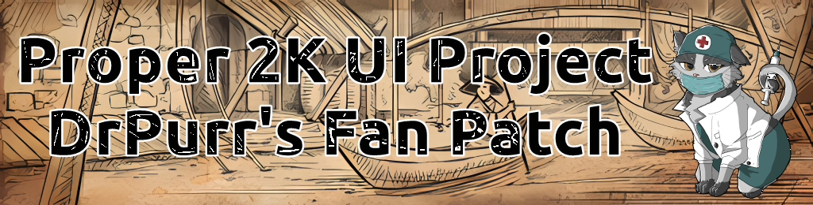

 

  

  <h3 align="center">Proper 2K UI Unofficial Patch</h3>

  

    <a href="https://github.com/DrPurr/Proper-2K-UI-Patch/issues">Report Bug</a>
    .
    <a href="https://github.com/DrPurr/Proper-2K-UI-Patch/issues">Request Feature</a>
  

   

## About The Project

A fan patch for Europa Universalis 1.34.5 Proper 2K UI Project. New alert badge art was AI upscaled with [Upscayl](https://github.com/upscayl/upscayll). Additional mod compatibility to follow.

## Compatibility Added

* [Plati's Tech Picture](https://steamcommunity.com/sharedfiles/filedetails/?id=2962916850) - This has just been added. It required some slight changes to the default 2K UI Project to get to work. Not required to download the original of all assets were re-scaled.

## Authors

* **DrPurr** - [GitHub](https://github.com/drpurr)

## Acknowledgements

* [LuvianQ](https://steamcommunity.com/id/luvian03/myworkshopfiles/) - Original Mod Creator
* [Plati](https://steamcommunity.com/profiles/76561198093911712/myworkshopfiles/) - Plati's Mods